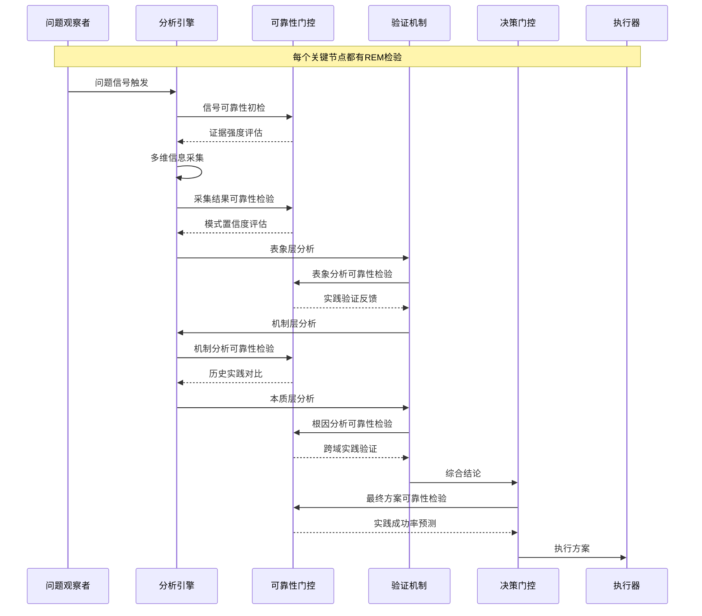
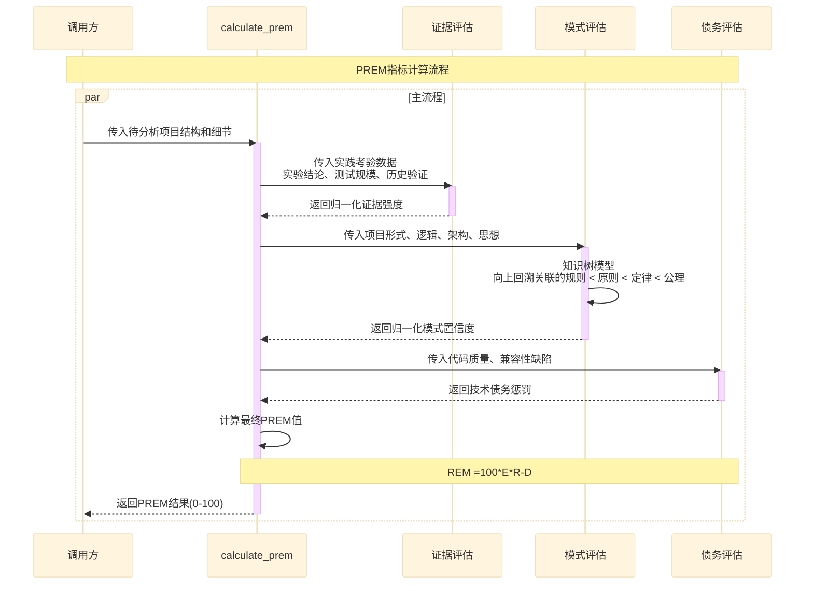

## 核心方法论

### STCAM核心评估协议



### 可靠性指标（PREM）
**Practice-based Reliability Evaluation Metric**



```python
def classify_rem(rem: float) -> str:
    """REM分级"""
    if rem > 80: return "极高可靠，参考复用"
    elif rem >= 60: return "高可靠，验证接口兼容性"  
    elif rem >= 30: return "中等可靠，检查环境配置"
    elif rem >= 10: return "低可靠，审查核心逻辑"
    else: return "极低可靠，深度质疑"
```
